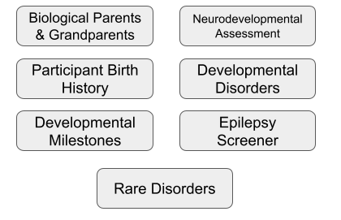

## Description

The Rare & Developmental (R&D) Disorder toolkit can be used to collect essential phenotypes associated with R&D related research, including: Birth History, Neurodevelopmental History, Epilepsy and System Anomalies. The following document establishes guidelines (particularly applicable in Africa) on how to use the toolkit and collect detailed, relevant and harmonized phenotype and exposure data for research. 

## Phenotypes

Phenotype protocols contained in the toolkit are illustrated in the figure below:

## Administration

The phenotype protocols contained in the toolkit range from Interviewer/Self-administered questionnaires and clinically-administered assessments. The toolkit is applicable to human participants of all life stages, though some phenotype protocols are age-specific. For more information on administration of the toolkit, see the toolkit guideline.

## References

The toolkit consists of both existing and novel data collection standards, and was based on several existing resources. These resources are listed below:

1. H3Africa DDD-Africa Case Report Forms
2. H3Africa Rare Diseases WG Case Report Forms
3. Protocol - Epilepsy Screener - Adult (www.phenxtoolkit.org/protocols/view/130401)
4. Protocol - Epilepsy Screener - Child/Proxy (www.phenxtoolkit.org/protocols/view/130402)
