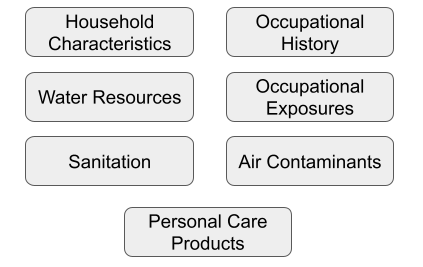

## Description

The Environmental Exposures toolkit can be used to collect information pertaining to: socio-economic status, occupational history, water resources and more. The following document establishes guidelines (particularly applicable in Africa) on how to use the toolkit and collect detailed, relevant and harmonised exposure data for research. 

## Phenotypes

Phenotype protocols contained in the toolkit are illustrated in the figure below:

## Administration

The phenotype protocols contained in the toolkit range from Interviewer/Self-administered questionnaires to bioassay/lab-based assessments. The toolkit is applicable to human participants of all life stages, though some phenotype protocols are age-specific. For more information on administration of the toolkit, see the toolkit guideline.

## References

The toolkit consists of both existing and novel data collection standards, and was based on several existing resources. These resources are listed below:

1. H3Africa Case Report Form Instruments
2. Instrument - Occupation/Occupational History (www.phenxtoolkit.org/protocols/view/60501) 
3. Instrument - Air Contaminants in the Home Environment (www.phenxtoolkit.org/protocols/view/61101) 
4. Instrument - Personal Care Products (www.phenxtoolkit.org/protocols/view/61501) 
5. Instrument - Home and Workplace Exposures to Floor and Wall Materials (www.phenxtoolkit.org/protocols/view/61401) 
6. WHO Core questions on drinking water and sanitation for household surveys (www.who.int/water_sanitation_health/monitoring/household_surveys/en/) 
