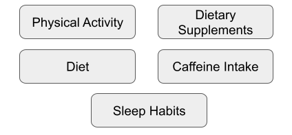

## Description

The Lifestyle Factors toolkit can be used to collect essential phenotypes associated with Lifestyle Factors in biomedical research, including: Physical Activity, Diet, Sleep Habits and more. The following document establishes guidelines (particularly applicable in Africa) on how to use the toolkit and collect detailed, relevant and harmonized phenotype and exposure data for research. 

## Phenotypes

Phenotype protocols contained in the toolkit are illustrated in the figure below:

## Administration

The phenotype protocols contained in the toolkit are Interviewer/Self-administered questionnaires, applicable to human participants of all life stages, though some phenotype protocols are age-specific. For more information on administration of the toolkit, see the toolkit guideline.

## References

The toolkit consists of both existing and novel data collection standards, and was based on several existing resources. These resources are listed below:

1. WHO Global Physical Activity Questionnaire (www.who.int/ncds/surveillance/steps/GPAQ/en/) 
2. Instrument - Dietary Intake (www.phenxtoolkit.org/protocols/view/231201) 
3. Instrument - Dietary Supplements Use (www.phenxtoolkit.org/protocols/view/50501) 
4. Instrument - Caffeine Intake (www.phenxtoolkit.org/protocols/view/50301) 
5. Pittsburgh Sleep Quality Index (www.sleep.pitt.edu/instruments/) 
6. Instrument - Sexual Risk Behavior - Male (www.phenxtoolkit.org/protocols/view/101701)  
7. Instrument - Sexual Risk Behavior - Female (www.phenxtoolkit.org/protocols/view/101702) 
