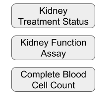

## Description

The Kidney Disease toolkit can be used to collect essential phenotypes associated with Kidney Disease-related research including personal History of Kidney Failure, Kidney Function Assay and Blood Cell Count. This document establishes guidelines (particularly applicable in Africa) on using the toolkit and collecting  detailed, relevant and harmonised phenotype and exposure data for research. 

## Phenotypes

Phenotype protocols contained in the module are illustrated in the figure below:

## Administration

The phenotype protocols contained in the toolkit range from Interviewer/Self-administered questionnaires to bioassay/lab-based assessments. The toolkit is applicable to human participants of all life stages, though some phenotype protocols are age-specific. For more information on administration of the toolkit, see the toolkit guideline.

## References

The toolkit consists of both existing and novel data collection standards, and was based on several existing resources. These resources are listed below:

1. Kumuthini J, van Woerden C, Mallett A, et al. Proposed minimum information guideline for kidney disease—research and clinical data reporting: a cross-sectional study, BMJ Open 2019;9:e029539.  DOI: 10.1136/bmjopen-2019-029539
2. Instrument - Personal History of Kidney Failure (www.phenxtoolkit.org/protocols/view/140601) 
3. Instrument - Complete Blood Count (CBC) (www.phenxtoolkit.org/protocols/view/220501)  
4. Sickle In Africa Core Data Elements (www.sickleinafrica.org/SIA_data_elements)
