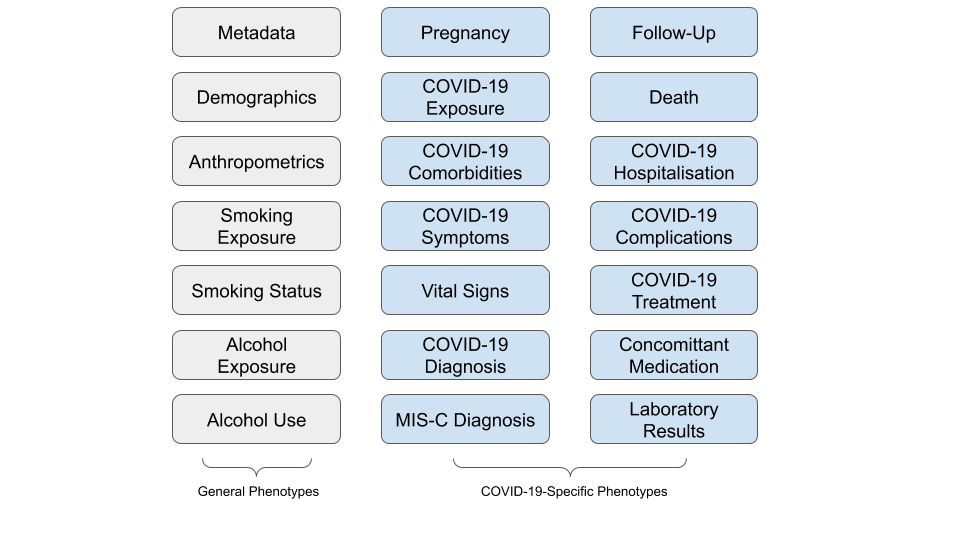

## Description

The COVID-19 module can be used to collect essential phenotypes associated with COVID-19 and MISC-related research, including: COVID-19 Exposure History; Symptoms and Signs; Comorbidities; COVID-19 Diagnoses and Treatments. The module is subdivided into core phenotypes (phenotypes incorporated from the H3Africa Standard) and COVID-19 &amp; MISC-specific phenotypes.

## Phenotypes

Phenotype protocols contained in the module are illustrated in the figure below:

## Administration

The phenotype protocols contained in the module range from Interviewer/Self-administered questionnaires to clinically-administered and bioassay/lab-based assessments. The module is applicable to human participants of all life stages, though some phenotype protocols are age-specific. For more information on administration of the module, see the module guideline.

## References

The module consists of both existing and novel data collection standards, and was based on several existing resources. These resources are listed below:

1. Global Effort on COVID-19 (GECO) Health Research Phenotype Questionnaire.
2. Enhanced COVID-19 Notifiable Medical Conditions (NMC) Notification Form (SA)
3. PHA4GE SARS-CoV-2 Contextual Data Specification - Collection template
4. NSW Government COVID-19 case questionnaire
5. WHO Global COVID-19 Clinical Platform: Rapid core case report form
6. WHO Global COVID-19 Clinical Platform: Case Report Form for suspected cases of Multisystem inflammatory syndrome (MIS) in children and adolescents temporally related to COVID-19
7. Enhanced MIS-C Notifiable Medical Conditions (NMC) Notification Form (SA)
8. Mayo Clinic Documentation ([https://www.mayoclinic.org/diseases-conditions/coronavirus/symptoms-causes/syc-20479963](https://www.mayoclinic.org/diseases-conditions/coronavirus/symptoms-causes/syc-20479963))
