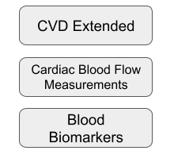

## Description

The Cardiovascular Disease (CVD) toolkit can be used to collect essential phenotypes associated with CVD related research, including; Anthropometrics, CVD History (Angina, Heart Attack, Congestive Heart Failure, Thyroid Disease) and more. 

## Phenotypes

Phenotype protocols contained in the toolkit are illustrated in the figure below:

## Administration

The phenotype protocols contained in the toolkit range from Interviewer/Self-administered questionnaires to clinically-administered and bioassay/lab-based assessments. The module is applicable to human participants of all life stages, though some phenotype protocols are age-specific. For more information on administration of the toolkit, see the toolkit guideline.

## References

The toolkit consists of both existing and novel data collection standards, and was based on several existing resources. These resources are listed below:

1. Protocol - Angina (www.phenxtoolkit.org/protocols/view/40601)
2. Protocol - Myocardial Infarction (www.phenxtoolkit.org/protocols/view/40801)
3. AWI-Gen Collaborative Centre - Cardiometabolic Disease Research Instruments
4. Stroke Investigative Research & Educational Network (SIREN) Instruments
5. Owolabi MO, Akpa OM, Made F, Adebamowo SN, Ojo A, Adu D, Motala AA, Mayosi BM, Ovbiagele B, Adebamowo C, Tayo B, Rotimi C, Akinyemi R, Gebregziabher M, Sarfo F, Wahab KW, Parekh RS, Engel ME, Chisala C, Peprah E, Mensah G, Wiley K, Troyer J, Ramsay M; as members of the CVD Working Group of the H3Africa Consortium. Data Resource Profile: Cardiovascular H3Africa Innovation Resource (CHAIR). Int J Epidemiol. 2019 Apr 1;48(2):366-367g. doi: 10.1093/ije/dyy261. PMID: 30535409; PMCID: PMC6469307.

