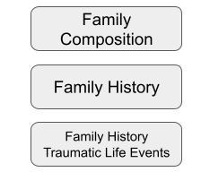

## Description

The FH toolkit can be used to collect essential information pertaining to the medical history of a research participant’s family. First, we define the types of relationships within the family, as we acknowledge that some family composition is not always biological. We then break down the various medical information we wish to glean into their various body systems, such as respiratory system, musculoskeletal system, nervous system etc. 

## Phenotypes

Phenotype protocols contained in the toolkit are illustrated in the figure below:

## Administration

The phenotype protocols contained in the toolkit are Interviewer/Self-administered questionnaires. The toolkit is applicable to human participants of all life stages, though some phenotype protocols are age-specific. For more information on administration of the toolkit, see the toolkit guideline.

## References

The toolkit consists of both existing and novel data collection standards, and was based on several existing resources. These resources are listed below:

1. AWI-Gen Collaborative Centre - Cardiometabolic Disease Research Instruments
2. GA4GH Family History Tools Inventory

